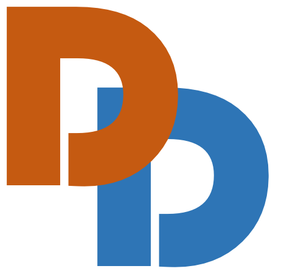

## About

Welcome to the Third DialDoc Workshop co-located with [ACL 2023](https://2023.aclweb.org).

The DialDoc workshop focuses on Document-Grounded Dialogue and Conversational Question Answering.
Given the vast amount of content created every day in various mediums, it is a meaningful yet challenging task not only
to make such content _accessible_ to end users via various conversational interfaces, but also to make sure the responses
provided by the models are _grounded_ and _faithful_ with respect to the knowledge sources. 

 ***Special Theme***  For our third workshop, we would like to highlight the theme of **_Factual Consistency_**. With recent advances of large language models, a major issue may arise when systems generate responses that include factual inconsistencies with respect to external sources, creating implications on user trust and safety. We seek submissions that tackle challenges around this issue, including, but not limited to, automatic evaluation methods, human evaluation, modeling techniques and datasets.

***Shared Task***  We also host a shared task on grounded dialogue based on multilingual documents, which aims to extend the current advances to languages other than English.

Topics of interests include, but are not limited to:

- Document-grounded dialogue and conversational machine reading;
- Knowledge-grounded dialogue generation with pre-trained language models;
- Open domain dialogue and conversational QA;
- Topical open-domain conversational chat;
- Parsing semi-structured document content for dialogue and conversational QA, table reading;
- Evaluation for document-grounded dialogue;
- Interpretability and faithfulness in dialogue modeling;
- Dialogue summarization and query-based summarization.

## Call for Papers

We welcome submissions of original work as long or short papers, as well as non-archival papers. We also accept papers
submitted via ARR as either archival or non-archival submissions. All accepted papers will be presented at the workshop.

We will have the ***Best Paper Award*** and ***Best Student Paper Award***, which will be announced during the workshop.

### Submission Instructions

Formatting Guidelines:
We accept long (eight pages plus unlimited references) and short (four pages plus unlimited references) papers, which
should conform to ARR CFP guidelines.

Non-Archival Submissions:
The accepted papers can opt to be non-archival.

The submission site on OpenReview is available [here](https://openreview.net/group?id=aclweb.org/ACL/2023/Workshop/DialDoc).

### Review Process

All submissions will be peer-reviewed by at least two reviewers. The reviewing process will be two-way anonymized.
Authors are responsible for anonymizing their submissions.

### Important Dates

- Direct paper submissions: May 2, 2023 ~~(April 24, 2023)~~
- Paper submissions with ARR reviews: May 10, 2023 ~~(April 24, 2023)~~
- Notification of Acceptance: May 22, 2023
- Camera-ready Paper Due Date: May 30, 2023
- Pre-recorded video due: June 12, 2023
- Workshop Date: July 13, 2023

## Shared Task

### Leaderboard
The competition is hosted on the Tianchi platform - [Leaderboard](https://tianchi.aliyun.com/competition/entrance/532063/information?lang=en-us)!

Please also join our [Google Group](https://groups.google.com/g/dialdoc) to further communications.

### Task
We invite the participants to join us to tackle a challenging Document-grounded Dialogue task in a multilingual setting! In this competition, you will be given a conversational query and a set of domain documents in Vietnamese and French. Your goal is to generate a piece of text that answers the query in the target language. 

To assess your performance, we will use the evaluation metrics such as token-level F1, SacreBleu and Rouge-L. You will be scored based on how accurately your generated response matches the ground-truth answer and how well it aligns with the target language. We will provide training data for this task, including 3,446 turns in Vietnamese and 3,510 turns in French. We have also organized the currently available Chinese and English document-grounded dialogue data. We hope that participants can leverage the linguistic similarities, for example, a large number of Vietnamese words are derived from Chinese, and English and French both belong to the Indo-European language family, to improve their models' performance in Vietnamese and French. Please note that no additional human annotated data is allowed. 

### Baseline
We have also provided a baseline model, which can be found at https://github.com/AlibabaResearch/DAMO-ConvAI/tree/main/acl23doc2dial. 

### Prizes
Cash prizes will be awarded to the top-performing participants. The winners will be determined based on their scores on the evaluation metrics. Additionally, we will require all winners to submit a technical paper describing their methods and approaches.

The prize pool is $7000 in total: 
- 1st Place: $3000; 
- 2nd Place: $1600; 
- 3rd Place: $1000; 
- 4th Place: $800; 
- 5th Place: $600. 

### Important Dates

The challenge includes leaderboards for two task settings with two phases, Dev (TestDev) and Test phase,

- Training data & Dev data release: February 17, 2023 
- Test data release: March 25, 2023 
- Winners announced: April 07, 2023
- Paper submission: May 2nd, 2023 ~~(April 24, 2023)~~

## Invited Speakers









## Organization

### Workshop Organizers













### Shared Task Organizers










### Program Committee

Srijan Bansal	(Carnegie Mellon University)  \
Daniele Bonadiman	(Amazon) \
Pengshan Cai	(University of Massachusetts - UMass Amherst) \
Danish Contractor	(IBM Research AI) \
Le Anh Cuong	(Ton Duc Thang University, Vietnam \
Nico Daheim	(Technische Universität Darmstadt) \
Sam Davidson	(UC Davis) \
Wanyu Du	(University of Virginia) \
Hao Fang	(Microsoft) \
Jatin Ganhotra	(IBM Research AI) \
Chang Gao	(The Chinese University of Hong Kong) \
Chulaka Gunasekara	(IBM Research AI) \
Ankita Gupta	(University of Massachusetts - UMass Amherst) \
Han He	(Emory University) \
Xiangkun Hu	(Amazon) \
Etsuko Ishii	(Hong Kong University of Science and Technology) \
Ehsan Kamalloo	(University of Alberta) \
Zichao Li	(McGill / Mila) \
Xing Han Lu	(McGill / Mila) \
Tran Thi Oanh	(Vietnam National University, Vietnam) \
Baolin Peng	(Microsoft) \
Xuan-Hieu Phan	(Vietnam National University, Vietnam) \
Kun Qian	(Columbia University) \
Le Hoang Quynh	(Vietnam National University, Vietnam) \
Min Yang	(Shenzhen Institutes of Advanced Technology, Chinese Academy of Sciences) \
Bowen Yu	(DAMO Academy Alibaba Group)

## Contact

Please join our [Google Group](https://groups.google.com/g/dialdoc) for the updates!

Please email us at [dialdoc2023-organizers@@googlegroups.com](dialdoc2023-organizers@@googlegroups.com) for questions
and suggestions.
